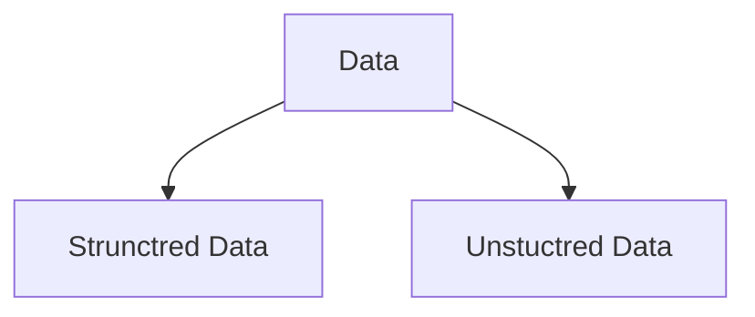
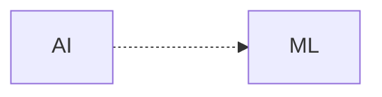
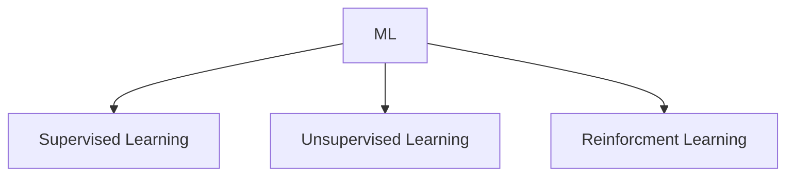
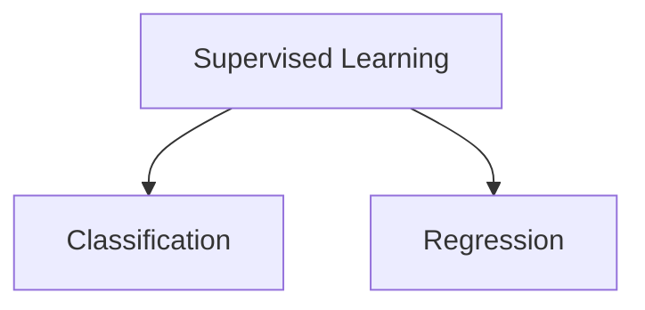
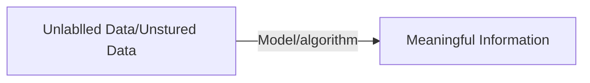

## Giving Computers ability to learn from Data
Application of science and algorithms that make sense of data.

#### Data is divided into 2 categories

#### Machine Learning Subfield of AI
Machine learning evolved as a subfield of **AI(Artificial Intelligence)**

This involves self learning algorithms that derives knowledge from data. 

Instead of requiring humans to manually derive rules and build models from analysing large amounts of data, machine learning offers a more efficient alternative for capturing the knowledge in data to gradually improve the performance of predictive models and make data-driven decisions.

## Three Different type of machine learning

### Supervised Learning/Label Learning

The main goal in supervise learning is to learn a **model** from **labeled training data** that allows to make prediction about unseen or future.

**Supervised** is refers to *trining examples (data inputs)*; desired *output signals(labels)* are known. **Labeled Data**

Supervised learning is then the process of modelling the **relationship** between the **data inputs and the labels**. Thus, we can also think of supervised learning as **label learning**.

> Labeled Data
> Direct Feedback
> Predict Outcome/Future

*Supervised learning process*

#### Classification

The goal is to predict the categorical class labels of new instances or data points based on past observations.
The task of classification is to assign categorical, unordered labels to instances.
![[Drawing 2022-11-15 14.47.09.excalidraw]]*classifying a new data point*

#### Regression/Regression Analysis.

Prediction of continuous outcomes, which is also called **regression analysis**.

In regression analysis, we are given a number of **predictor (explanatory) variables; Features and a continuous response variable (outcome); Target Variables**, and we try to find a **relationship**
between those variables that allows us to predict an outcome.

![[Drawing 2022-11-15 15.24.48.excalidraw]]

### Unsupervised Learning

> No Labels/Targets
> No Feedback
> Find hidden structure in data

#### Clustering

### Reinforcement Learning

In reinforcement learning, the goal is to develop a **system (agent)** that improves its performance based on interactions with the **environment; reward signal**

![[Drawing 2022-11-15 15.30.17.excalidraw]]
Reinforcement learning is concerned with learning to choose a series of actions that maximises the total reward, which could be earned either immediately after taking an action or via delayed feedback.

> Decision Process
> Reward System
> Learn series of actions

