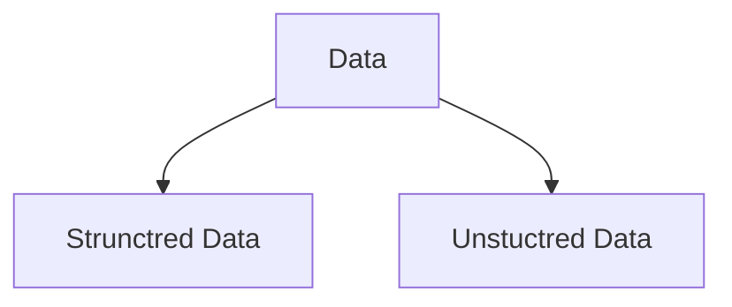
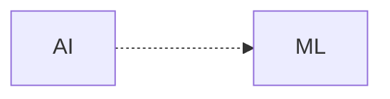
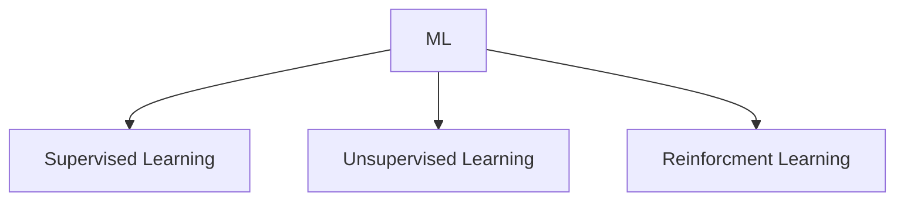
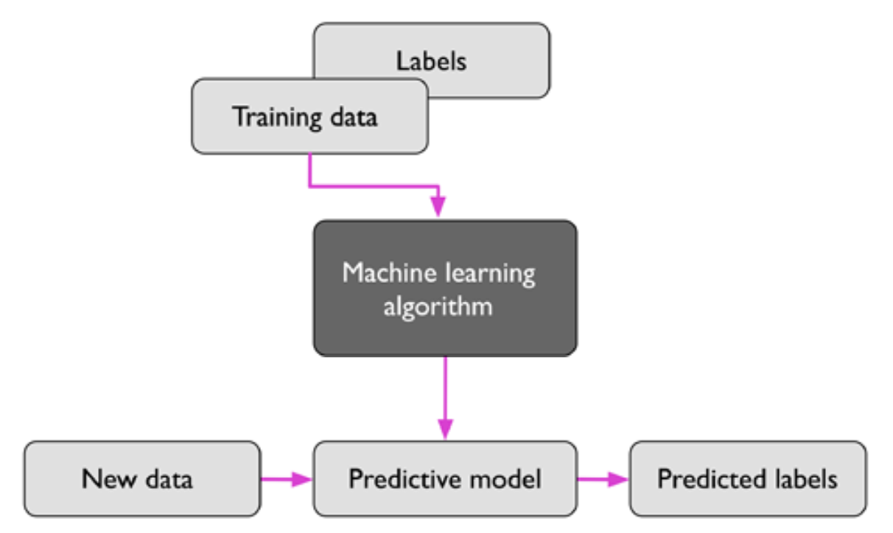
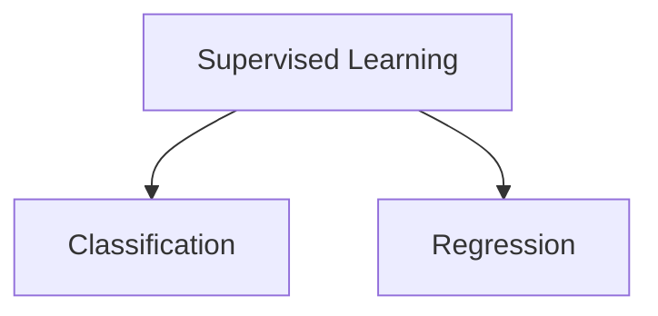
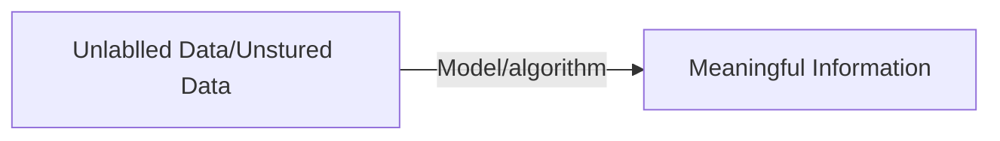
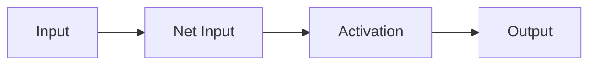

# 1. Giving Computers ability to learn from Data

Application of science and algorithms that make sense of data.

#### Data is divided into 2 categories

#### Machine Learning Subfield of AI
Machine learning evolved as a subfield of **AI(Artificial Intelligence)**

This involves self learning algorithms that derives knowledge from data. 

Instead of requiring humans to manually derive rules and build models from analysing large amounts of data, machine learning offers a more efficient alternative for capturing the knowledge in data to gradually improve the performance of predictive models and make data-driven decisions.

## Three Different type of machine learning

### Supervised Learning/Label Learning

The main goal in supervise learning is to learn a **model** from **labeled training data** that allows to make prediction about unseen or future.

**Supervised** is refers to *trining examples (data inputs)*; desired *output signals(labels)* are known. **Labeled Data**

Supervised learning is then the process of modelling the **relationship** between the **data inputs and the labels**. Thus, we can also think of supervised learning as **label learning**.

> Labeled Data
> Direct Feedback
> Predict Outcome/Future

*Supervised learning process*

#### Classification

The goal is to predict the categorical class labels of new instances or data points based on past observations.
The task of classification is to assign categorical, unordered labels to instances.
![[Drawing 2022-11-15 14.47.09.excalidraw]]*classifying a new data point*

#### Regression/Regression Analysis.

Prediction of continuous outcomes, which is also called **regression analysis**.

In regression analysis, we are given a number of **predictor (explanatory) variables; Features and a continuous response variable (outcome); Target Variables**, and we try to find a **relationship**
between those variables that allows us to predict an outcome.

![[Drawing 2022-11-15 15.24.48.excalidraw]]

### Unsupervised Learning

> No Labels/Targets
> No Feedback
> Find hidden structure in data

#### Clustering/Unsupervised Classification

Clustering is an exploratory data analysis or pattern discovery technique that allows us to organise a pile of information into meaningful **subgroups (clusters)**.

Each cluster that arises during the analysis defines a group of objects that share a **certain degree of similarity but are more dissimilar to objects in other cluster**. 

![[Drawing 2022-11-15 22.00.25.excalidraw]]

#### Dimensionality reduction

Dimensionality reduction compresses the data onto a smaller dimensional subspace while retaining most of the relevant information.

Most of the time used in **feature preprocessing** to remove noice data.
also can be used data visualisation.

![[Drawing 2022-11-15 22.08.28.excalidraw]]

### Reinforcement Learning

In reinforcement learning, the goal is to develop a **system (agent)** that improves its performance based on interactions with the **environment; reward signal**

![[Drawing 2022-11-15 15.30.17.excalidraw]]
Reinforcement learning is concerned with learning to choose a series of actions that maximises the total reward, which could be earned either immediately after taking an action or via delayed feedback.

> Decision Process
> Reward System
> Learn series of actions

## Notation and conventions used in ML

![[Drawing 2022-11-15 22.14.57.excalidraw]]

**feature matrix**; *X*, where each feature is stored as a separate column.
![[Drawing 2022-11-15 22.26.22.excalidraw]]
Each row in matrix (a flower) can be written as a four dimensional single row vector

$$
x^{i} \in R^{1 \times 4}
$$
$$
X^{(i)} = \begin{bmatrix} x_{1}^{i} & x_{2}^{i} & x_{3}^{i} & x_{4}^{i} \end{bmatrix} 
$$
Each feature dimension is a 150-dimensional column vector
$$
X^{i} \in R^{150 \times 1}
$$
$$
x_{(j)} = \begin{bmatrix} x_{j}^{1} \\ x_{j}^{2} \\ .. \\ x_{j}^{150} \end{bmatrix} 
$$
Similarly, target variables (here, class labels) as a 150-dimensional
column vector
$$
y_{(j)} = \begin{bmatrix} y^{1} \\ y^{2} \\ .. \\ y^{150} \end{bmatrix} \text{, where } y^{(i)} \in \{Setosa, Versicolor, Virginica\}
$$

### Machine learning Terminologies

* **Trining Example**: *A row in a table representing the dataset* and synonymous with an observation, record, instance, or sample (in most contexts, sample refers to a collection of training examples).
* **Training**: *Model fitting*, for parametric models similar to parameter estimation.
* **Feature, abbrev.$x$**: A column in a data table or data (design) matrix. Synonymous with predictor, variable, input, attribute, or covariate
* **Target, abbrev.$y$**: Synonymous with outcome, output, response variable, dependent variable, (class) label, and ground truth
* **Loss function**: Often used synonymously with a *cost function*. Sometimes the loss function is also called an *error function*. In some literature, the term “loss” refers to the loss measured for a single data point, and the cost is a measurement that computes the loss (average or summed) over the entire dataset.

## A roadmap for building machine learning systems

![[Drawing 2022-11-16 12.06.24.excalidraw]]

#### Preprocessing Data

Many machine learning algorithms also require that the selected features are on the same scale for optimal performance, which is often achieved by **transforming the features in the range [0, 1] or a standard normal distribution with zero mean and unit variance**.

Some of the selected features may be highly correlated and therefore redundant to a certain degree. In those cases, **dimensionality reduction techniques** are useful for compressing the features onto a lower-dimensional subspace.

we also want to randomly divide the dataset into separate **training and test datasets**.

#### Training and selecting a predictive model

it is essential to compare at least a handful of different learning algorithms in order to train and select the best performing model.

To compare, we first have to decide upon a metric to measure performance. One commonly used metric is **classification accuracy**, which is defined as the proportion of correctly classified instances

In **cross-validation**, we further divide a dataset into training and validation subsets in order to estimate the generalisation performance of the model.

we will make frequent use of **hyper-parameter optimisation** techniques that help us to fine-tune the performance of our model.

#### Evaluating models and predicting unseen data instances

After we have selected a model that has been fitted on the training dataset, we can use the test dataset to estimate how well it performs on this unseen data to estimate the so-called **generalisation error**.

# 2. Training Simple Machine Learning Algorithms for Classification

## Artificial Neurons

![[Drawing 2022-11-16 14.54.14.excalidraw]]

Biological neurons are interconnected nerve cells in the brain that are involved in the processing and transmitting of chemical and electrical signals

multiple signals arrive at the dendrites, they are then integrated into the cell body, and, if the accumulated signal exceeds a certain threshold, an output signal is generated that will be passed on by the axon.

Frank Rosenblatt published the first concept of the **perceptron** learning rule
based on the MCP neuron model (The Perceptron: A Perceiving and Recognising Automaton by F. Rosenblatt, Cornell Aeronautical Laboratory, 1957)

Rosenblatt proposed an algorithm that would automatically learn the optimal weight **coefficients that would then be multiplied with the input features in order to make the decision of whether a neuron fires (transmits a signal) or not**.

#### Definition

artificial neurons into the context of a binary classification task with two classes: 0 and 1; decision function, $\sigma(z)$; input values, $x$, corresponding weigh vector, $w$; net input, $z$. 
$$
z = w_{1}x_{1} + w_{2}x_{2} + ... + w_{m}x_{m}
$$
$$
w = \begin{bmatrix} w_{1} \\
. \\
.\\
w_{m}
\end{bmatrix}, \text{ } x = \begin{bmatrix} x_{1} \\
. \\
.\\
x_{m}
\end{bmatrix}
$$

net input ($z$) of $x^{(i)}$ $\geq$ threshold ($\Theta$) than class 1; class 0 otherwise.

In the perceptron algorithm, the **decision function, $\sigma(z)$**, is a variant of
a **unit step function**.
![[Drawing 2022-11-18 15.32.05.excalidraw]]
  
##### To simplify the code implementation
1. Move the threshold, $\theta$ ,to the left side of the equation:	
$$z \geq \theta$$ 
2. Define **bias unit**; $b = -\theta$ and make it part of the net input:
$$
z = w_{1}x_{1} + ... +  w_{m}x_{m} + b = w^{t}x + b
$$ 
3. given the introduction of the bias unit and the redefinition of the net input z above, we can redefine the decision function as follows 
![[Pasted image 20221117141823.png]]

>refer vector dot product

net input ($z$) = $w^{t}x + b$

![[Drawing 2022-11-18 15.34.36.excalidraw]]

#### The Perceptron learning rule

1. Initialise the weights and bias unit to 0 or small random numbers
2. For each training example, $x^{(i)}$:
	a. Compute the output value, $\hat{y}^{(i)}$; predicted by unit step function
	b. Update the weights (each weights $w_{j}$) and bias unit
$$
w_{j} = w_{j} + \delta w_{j}
$$
$$
b = b + \delta b
$$
**Computing deltas**:
$$ \delta w_{j} = \eta \left (y^{(i)} - \hat{y}^{(i)} \right ) x_{j}^{(i)}$$
$$\delta b = \eta \left (y^{(i)} - \hat{y}^{(i)} \right )$$
$\eta$ - learning rate
$y^{(i)}$ - true class label
$\hat{y}^{(i)}$ - predicted class label

The perceptron predicts the class label correctly, the bias unit and weights remain unchanged.
In the case of a wrong prediction, the weights are being pushed toward the direction of the positive or negative target.

Convergence of the perceptron is only guaranteed if the two classes
are linearly separable

![[Drawing 2022-11-18 22.21.17.excalidraw]]

If the two classes can’t be separated by a linear decision boundary, we can set a maximum number of **passes over the training dataset (epochs)** and/or a **threshold for the number of tolerated misclassifications**—the perceptron would never stop updating the weights otherwise

![[Drawing 2022-11-18 22.23.40.excalidraw]]

> python implementation of python

##### One-versus-All (OvA)/ One-versus-Rest (OvR)

Technique that allows us to extend any binary classifier to multi-class problems all other classes are considered negative classifier to multi-class problems. 

If we were to classify a new, unlabelled data instance, we would use our $n$ classifiers, where $n$ is the number of class labels, and assign the class label with the highest confidence to the particular instance we want to classify

#### ADAptive LInear NEuron (Adaline)

* **Single-layer neural network (NN)**
* The weights are updated based on a linear activation function; $\sigma(z) = z$

![[Drawing 2022-11-20 16.33.05.excalidraw]]

##### Minimising loss functions with gradient descent
[Video lecture on Gradient Descent](https://www.youtube.com/watch?v=sDv4f4s2SB8)

**objective function**: that is to be optimised during the learning process; often a **loss or cost function ($L$)** 

###### Mean Squared Error (MSE)

$$
L(w,b) = \frac{1}{2n} \sum_{i = 1}^{n} \left (y^{(i)} - \sigma \left (z^{(i)} \right ) \right )^{2}  
$$
$y^{(i)}$: true label
$\sigma\left (z^{(i)} \right)$: calculated outcome
$\frac{1}{2}$: make easier to derive the gradient of the loss function

![[Drawing 2022-11-20 22.56.19.excalidraw]]

- Using gradient descent, we can now update the model parameters by taking a step in the *opposite direction of the gradient*,$\bigtriangledown L\left(w,b\right)$: of our loss function, $L\left(w,b\right)$:
$$
w = w + \delta w, \text{ } b = b + \delta b 
$$
- The parameter changes, $\delta w$ ࢝and the $\delta b$, are defined as the *negative gradient multiplied by the learning rate*, $\eta$:
$$
\delta w = - \left(\eta \bigtriangledown _{w}L\left(w, b\right)\right)
$$
$$
\delta b = - \left(\eta \bigtriangledown _{b}L\left(w, b\right)\right)
$$
- To compute the gradient of the loss function, we need to compute the **partial derivative** of the loss function with *respect to each weight*, $w_{j}$:
$$
\frac{\partial L}{\partial w_{j}} = - \frac{2}{n} \sum_{i} \left(y^{(i)} - \sigma \left(z^{(i)}\right) \right) x_{j}^{(i)}
$$
- Compute the partial derivative of the loss with *respect to the bias* as:
$$
\frac{\partial L}{\partial b} = - \frac{2}{n} \sum_{i} \left(y^{(i)} - \sigma \left(z^{(i)}\right) \right)
$$
##### Update:
$$
\delta w = -\eta \frac{\partial L}{\partial w_{j}} \text{ and } \delta b = \frac{\partial L}{\partial b}
$$
$$
w = w + \delta w \text{ and } b = b + \delta b
$$

Weight update is calculated based on all examples in the training dataset (instead of updating the parameters incrementally after each training example), which is why this approach is also referred to as **batch gradient descent**/**full batch gradient decent**.

**Singel layer (NN)**

##### Hyperparameters
The learning rate, $\eta$, as well as the number of epochs, are the so-called hyper-parameters (or tuning parameters) of the perceptron and Adaline learning algorithms.

In practice, it often requires some experimentation to find a good learning rate, $\eta$ ,for optimal convergence.

![[Drawing 2022-11-26 11.26.47.excalidraw]]

#### Feature Scaling

##### Standardisation
Standardisation shifts the mean of each feature so that it is centered at zero and each feature has a standard deviation of 1 (unit variance)
$$
x_{j}' = \frac{x_j - \mu_{j}}{\sigma_j}
$$
$x_{j}'$ - Standardisation of the $j$th feature
$x_j$ - vector consisting of the $j$th feature values
$\mu_{j}$ - sample mean
$\sigma_{j}$ - standard deviation

![[Drawing 2022-11-26 12.40.33.excalidraw]]
